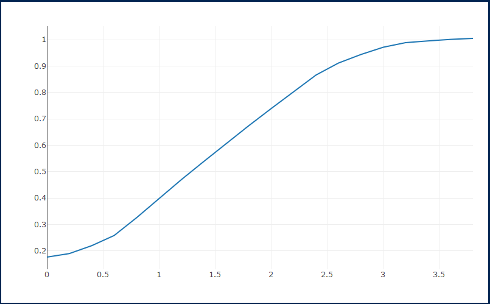
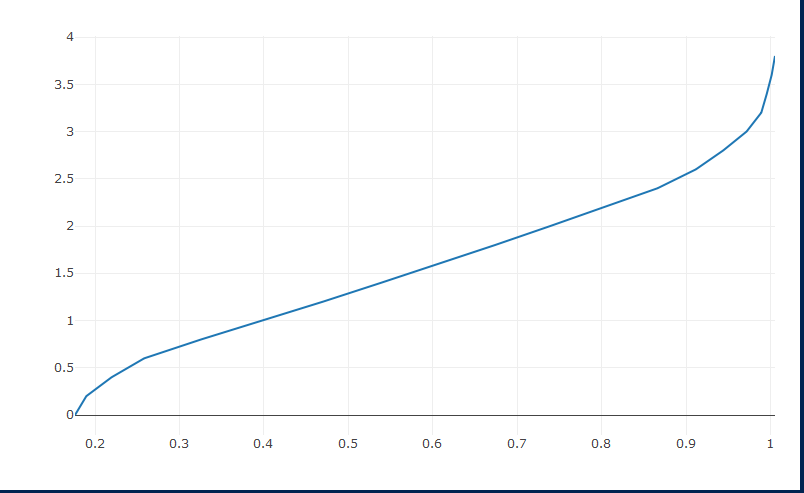

Module 5 - Part to Whole and Ranking Analysis
================
For this project, I could not get the website 'Plot.ly' to work. I had spent hours tryinng to figure it out but it would not load for me and I could not create any graphs. I have alternatively used the plot.ly package in R to create graphs.
``` r
library(readxl)
df <- read_excel("C:/Users/adamw/Downloads/Module # 5.xlsx")
```

``` r
a <- list(
  title = "AXIS TITLE",
  showticklabels = TRUE,
  tickangle = 45,
  exponentformat = "E")
  
library(plotly)
```
The first graph shown is a simple dot plot showing the Time by the Average Position.

``` r
p <- plot_ly(data = df, x = df$Time, y = df$`Average Position`, type = 'scatter')

p2 <- plot_ly(df, x = df$`Average Position`, y = df$Time, type = 'scatter', mode = 'lines')

p
```




``` r
p2
```

The second graph is a line plot showing the Average Position by Time.




